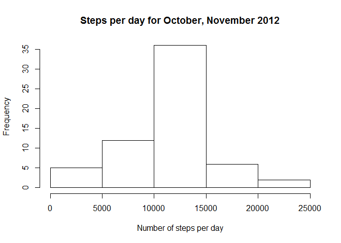

## Loading and preprocessing the data
###1. Read data

```r
currwd <- "/Users/adanz/Dropbox/Danz Cloud/classwork/Data Science - Coursera/5 Reproducible research/week 2/project/Factivity/RepData_PeerAssessment1"
setwd(currwd)
activity <- read.csv(unz("activity.zip", "activity.csv"), header=T)
```


## What is mean total number of steps taken per day?
###2. Histogram of total steps per day

```r
stepsPerDay <- tapply(activity$steps, activity$date, sum, na.rm = TRUE)
hist(stepsPerDay, main="Steps per day for October, November 2012", xlab="Number of steps per day") 
```

<!-- -->

###3. Mean & median steps per day

```r
meanStepsPerDay = mean(stepsPerDay)
mednStepsPerDay = median(stepsPerDay)
```


## What is the average daily activity pattern?
###4. Time series plot of the avg number of steps per day

```r
avgIntervals <- tapply(activity$steps, activity$interval, mean, na.rm = TRUE)
unqIntervals <- unique(activity$interval)
plot(unqIntervals, avgIntervals, type="l", xlab="time(HHMM)", ylab="avg number of steps")
```

<!-- -->

###5. The 5-minute interval that, on average, contains the maximum number of steps

```r
maxIdx = which(avgIntervals==max(avgIntervals))
maxInterval = unqIntervals[maxIdx]
```


## Imputing missing values
###6. Code to describe and show a strategy for imputing missing data
#### Here we replace missing data with the average for that time interval across days.

```r
activityNaIdx <- is.na(activity$steps)
naTot <- sum(activityNaIdx)
```

###7. Histogram of the total number of steps taken each day after missing values are imputed
#### Fill in missing vals with mean for that 5-min interval

```r
naInterval <- activity$interval[activityNaIdx]
naIntIdx <- match(naInterval, unqIntervals)
activityNoNa <- activity
activityNoNa$steps[activityNaIdx] <- avgIntervals[naIntIdx]
```

#### display Histogram 

```r
stepsPerDay2 <- tapply(activityNoNa$steps, activityNoNa$date, sum)
hist(stepsPerDay2, main="Steps per day for October, November 2012", xlab="Number of steps per day")
```

<!-- -->

### Mean & median steps per day

```r
meanStepsPerDay2 = mean(stepsPerDay2)
mednStepsPerDay2 = median(stepsPerDay2)
```

## Are there differences in activity patterns between weekdays and weekends?
###8. Panel plot comparing the average number of steps taken per 5-minute interval across weekdays and weekends
#### Create weekday/weekend factors

```r
dayofweek <- weekdays(as.Date(activityNoNa$date), abbreviate = T)
isWeekend <- (dayofweek == "Sat") | (dayofweek == "Sun")
isWeekend <- factor(isWeekend, labels = c("Weekday", "Weekend"))
activityNoNa$weekday <- isWeekend
```

#### Create a time series pannel plot by weekday type

```r
par(mfrow=c(2,1))
weekendIdx <- activityNoNa$weekday == "Weekend"
avgIntervalsWeekday <- tapply(activityNoNa$steps[!weekendIdx], activityNoNa$interval[!weekendIdx], mean, na.rm = TRUE)
plot(unqIntervals, avgIntervalsWeekday, type="l", xlab="time(HHMM)", ylab="avg number of steps", main="Weekdays")
avgIntervalsWeekend <- tapply(activityNoNa$steps[weekendIdx], activityNoNa$interval[weekendIdx], mean, na.rm = TRUE)
plot(unqIntervals, avgIntervalsWeekend, type="l", xlab="time(HHMM)", ylab="avg number of steps", main="Weekends")
```

<!-- -->


